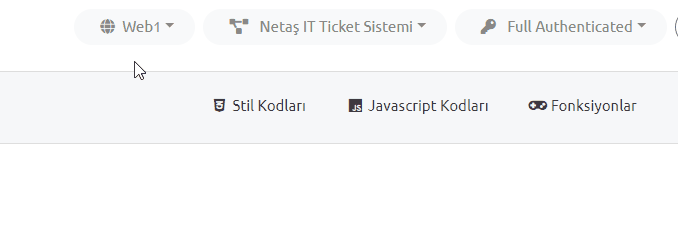

# 2. Getting Started
In this section, you can learn how to start designing.

# 1. Login to App

- Enter Dynamite web site and go `/login` page.
- **Username** and **password** is your personal admin username for **Test Environment.**
- Enter your credentials and click login button.


---

# 2. Welcome Screen

## 2.1 After login...

    After login, you will see 'Settings and services are loading...' text.
    This is for loading of Mobi-fi API Endpoint list.
    [Only for login to app] :)
    


## 2.2 We are ready, and you?
- We have page list on left sidebar,
- Platform, project, auth object dropdowns on top right panel,
- and **welcome** message :)


---

# 3. How to save a page design to database?

- Mobi-fi saves page designs to database with platform id and auth object id which belongs to selected project.
- Page designs are created as **JSON** data with component properties.
- They also includes style, script settings, controller functions and data sources for using components.
- And client applications which have abilities to render this JSON data render and show them.
---
# 4. Side and Top Panel
You can use panel described below.

## 4.1 Selecting a page to design
Page can be selected from left side panel.


## 4.2 Configuring the platform and auth object
This configuration can be made from top right panel.



## 4.3 Saving, exporting and publishing area
A page can be saved, exported or published to database easily.


# 5. Simple Learning Tutorial

We will make a simple page with Dynamite using all settings.

## 5.1 Let's start to design creating some custom styles

- Click **Style Codes**
- Add some styles

```
.font-size-18 { font-size: 18px !important; }
.color-gray { color: #999 !important; }
#frm1-button-red { color: #f00 !important; border-color: #f00 !important; }
```
- Click **Save**


## 5.2 Adding Javascript codes 

- Click **Javascript Codes**
- Add some Javascript code for **OnInit** and **OnDestroy** sections.

OnInit;

```
welcome = function() { alert('Welcome to Dynamite!'); }
welcome();
```

OnDestroy;

```
delete welcome;
```

- Click **Save**.

> _**Do not use any frameworks like AngularJS, jQuery, etc. Use only Javascript!**_

## 5.3 Adding Controller functions

- Click **Functions**
- Click **Add function** and rename function name as `test`
- Type inner body of function

```
alert('test function executed');
```

- Click **Save**.

## 5.4 Adding Data sources

There are 4 types of data sources described below.

### 5.4.1 Adding Service data sources

- Click **Data Sources**
- Click **Add data source** and rename source name as `serviceTest`
- Choose **Service** as source type
    - Service Name: `app.attachment`
    - Method Name: `getAllWithActionAndRequestAttachment`
    - Bind Model: `attachmentListModel`
- Click **Save**.

> _**We will use this data source in Attachment List component called `attachmentList`.**_

### 5.4.2 Adding SQL Query data sources

- Click **Data Sources**
- Click **Add data source** and rename source name as `queryTest`
- Choose **Query** as source type
    - Query Name: `Q_NM_GetRequestCountsByDepatments`
- Click **Save**.

### 5.4.3 Adding Existing Model data source

- Click **Data Sources**
- Click **Add data source** and rename source name as `modelTest`
- Choose **Existing Model** as source type
    - Model Variable: `attachmentList.model[0]`
- Click **Save**.

### 5.4.4 Adding Static Model data source

- Click **Data Sources**
- Click **Add data source** and rename source name as `staticModelTest`
- Choose **Static Model** as source type
    - Data:
```
[
    { "name": "Umut", "surname": "Çakır", "id": 1 },
    { "name": "Caner", "surname": "Genç", "id": 2 },
    { "name": "Doğancan", "surname": "Topel", "id": 3 }
]
```
- Click **Save**.

## 5.5 Creating Content components

We will create **Attachment List** and **Form** components to show settings.

### 5.5.1 Adding Attachment List

- Click **(+) Add** button.
- Choose **Attachment List**.
- Settings Panel;


#### 5.5.1.1 General Settings

- Name: `attachmentList`,
- Order: `1`,
- Size: `12x`

#### 5.5.1.2 Text and Language Settings

We will add component title text for `TR` and `EN`.

- Click **Add translation**
    - Element: `LABEL_TITLE`
    - Language: `TR`
    - Text: `Eklenti Listesi`
    - Click **Add**.
- Click **Add translation**
    - Element: `LABEL_TITLE`
    - Language: `EN`
    - Text: `Attachment List`
    - Click **Add**.
    
#### 5.5.1.3 Getting Data Settings

- Source name: `serviceTest`
- Click **Add parameter**
    - Name: `tableId`
    - Type: `Static Variable`
    - Value: `31`
    - Click **Add**
- Click **Add parameter**
    - Name: `rowId`
    - Type: `Static Variable`
    - Value: `273285`
    - Click **Add**
    
#### 5.5.1.4 Authorization Settings

We will add `İşlerim` authorization object to `BUTTON_DOWNLOAD_ALL_ATTACHMENTS`

- Click **Add authorization object**
    - Element: `BUTTON_DOWNLOAD_ALL_ATTACHMENTS`
    - Object: `İşlerim`
    - Click **Add**
    
#### 5.5.1.5 Event Settings

We will add controller function event to `BUTTON_REMOVE_ATTACHMENT`

- Click **Add event**
    - Element: `BUTTON_REMOVE_ATTACHMENT`
    - Run: `OnClick`
    - Type: `Method`
    - Value: `test`
    - Click **Add parameter**
        - Name: `testParameter`
        - Type: `Global Variable`
        - Value: `attachmentList.model[$].name`
        - Click **Add**

> **_ $ symbol in [$] is index of clicked element in data model. _**

_**SOME CHANGES... :)**_

We will add the same controller function event to `BUTTON_REMOVE_ATTACHMENT` with **different** parameters.

- Click **Add event**
    - Element: `BUTTON_REMOVE_ATTACHMENT`
    - Run: `OnClick`
    - Type: `Method`
    - Value: `test`
    - Click **Add parameter**
        - Name: `$`
        - Type: `Global Variable`
        - Value: `attachmentList.model[$]`
        - Click **Add**
    - Click **Add parameter**
        - Name: `extraParam`
        - Type: `Static Variable`
        - Value: `2`
        - Click **Add**
        
> **_ `$` symbol in parameter name means that all parameters will equal to value directly. _**

> **_ `extraParam` will be added to parameters object. If parameters are equals to Array, it will be added to all objects in array. _**

#### 5.5.1.6 Style Settings

We will add **font** and **color** properties to `BUTTON_DOWNLOAD_ALL_ATTACHMENTS`

- Click **Add style**
    - Element: `BUTTON_DOWNLOAD_ALL_ATTACHMENTS`
    - Value: `.font-size-18 .color-gray`
    - Click **Add**
    
- **SAVE** and **close** modal. :)

---

### 5.5.2 Adding Form

- Click **(+) Add** button.
- Choose **Form**.

#### 5.5.2.1 General Settings

- Name: `frm1`
- Order: `2`
- Size: `12x`

#### 5.5.2.2 Text and Language Settings

- Click **Add translation**.
    - Element: `LABEL_TITLE`
    - Language Type: `TR`
    - Text: `Test Formu`
    - Click **Add**
- Click **Add translation**.
    - Element: `BUTTON_SUBMIT`
    - Language Type: `TR`
    - Text: `Gönder`
    - Click **Add**
    
#### 5.5.2.3 Getting Data Settings

We will use **first index** of attachment list model.

- Source Name: `modelTest`

#### 5.5.2.4 Event Settings

We will add event to `BUTTON_SUBMIT`.

- Click **Add event**
    - Element: `BUTTON_SUBMIT`
    - Run: `OnClick`
    - Type: `Page`
    - Target: `New Tab`
    - Value: `UmutDemo`
    - Click **Add**

And Form is **Ready!**

## 5.6 Creating Item components

We will add **Select component** to Form component.


### 5.6.1 Adding Select component

We can add item component like adding content component. Choose and add. :)

#### 5.6.1.1 General Settings

 - Name: `selectId`
 - Model Key: `id`
 - Order: `1`
 - Size: `12x`
 
#### 5.6.1.2 Text and Language Settings
 
- Click **Add translation**.
    - Element: `LABEL_TITLE`
    - Language Type: `TR`
    - Text: `Eklenti No`
    - Click **Add**
- Click **Add translation**.
    - Element: `LABEL_TITLE`
    - Language Type: `EN`
    - Text: `Attachment ID`
    - Click **Add**
    
#### 5.6.1.3 Value Settings

We will add static value to select and its display value will come from data model. :) 

> _**If there is no data model, we can add a source as default value and set display and value keys of default value.**_

- Choose **Static Value**
    - Value: `2`
    
#### 5.6.1.4 Validation Settings

We will only check the **Required** validation to true.

#### 5.6.1.5 Getting Data Settings

- Source name: `staticModelTest`
- Display key: `name`
- Value key: `id`

Select component is **READY!**
