# 1. Introduction

Dynamite is a web page design tool for Mobi-fi Service Management Application for now. You can design new or existing pages in Dynamite by using awesome components.

> _**Dynamite is the best page design tool for Mobi-fi!**_

---

Dynamite's page design tool consists of

* general styles and scripts,
* controller functions,
* data sources,
* components and their settings which are
    * general settings,
    * language settings,
    * getting data settings,
    * value settings,
    * validation settings,
    * auth settings,
    * event settings,
    * style settings,
    * special settings

## What you need to know...

### Special DOM Elements
Dynamite Components are made up of HTML, CSS and JS. In this HTML DOM tree, some tags are special for that component. For example; A Heading Tag as title for Form component. We can access this element from Dynamite and change its style, label text, events, etc.

### Global Dynamic Variables
Dynamite components can be accessed from console with their unique names. These are called as global dynamic variables. For their access methods, you can look their sections.

> _**And there are some system variables starts with `_`(underscore) symbol. You can look them from system variables section.**_

### Parameters
In Dynamite, for getting and posting data, triggering events we use parameters. There are two parameter types. Global and static params...

- **Global parameters**: They are global dynamic variables
- **Static parameters**: They are static variables

---

# General Styles and Scripts
Dynamite allows us to change page styles and create custom styles and we can generate custom scripts to execute on page when page is ready and page is destroyed.

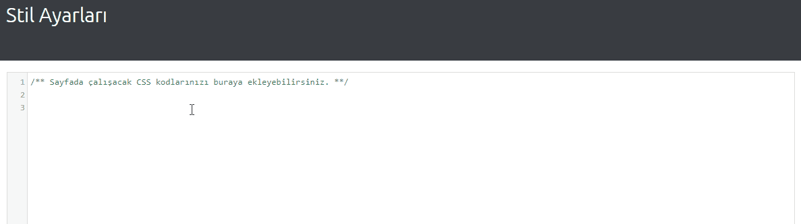

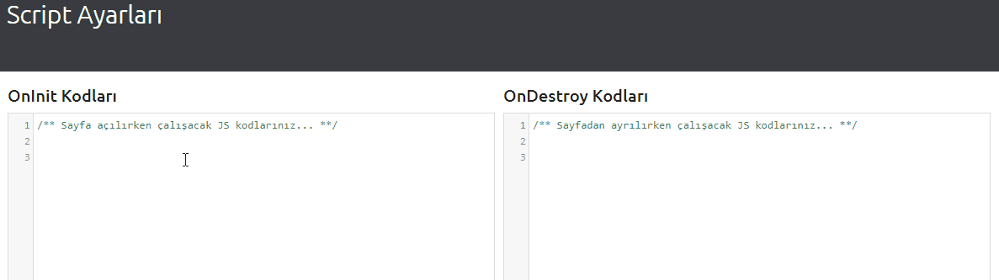

---

# Controller Functions
In Dynamite, components and their special elements have some events like `click`, `beforeClick`, `onClickSuccess`, etc. and they can trigger some custom functions with some parameters called as controller functions.

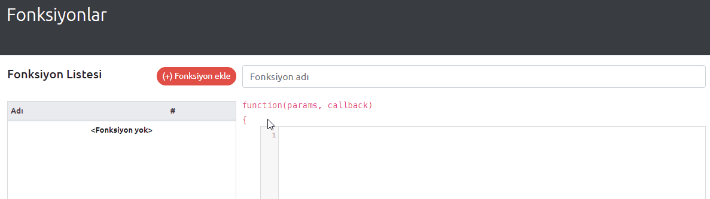

---

# Data Sources
For getting and posting data from Dynamite Client Applications, we should create data sources and use them.
Data sources are created as

- API Endpoint,
- SQL Query,
- Existing Model (Global Dynamic Variable),
- Static Data (JSON)

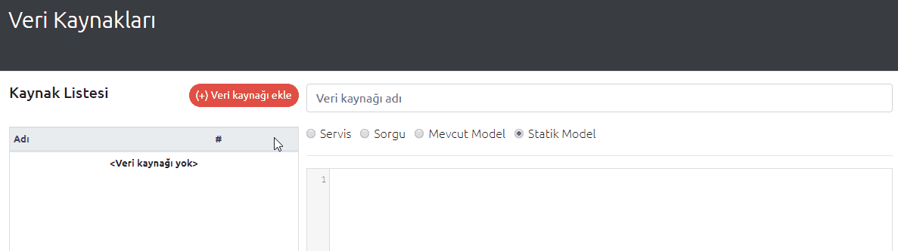

---

# Components
Components are everything for Dynamite and its client applications.

- Client applications render components which are generated **Angular Components** that can be used for user interaction.
- There are two component types in Dynamite. These are **contents** and **items**.
- Contents are main components which can be used directly in a page without an item. (e.g.: Forms)
- Items are helper components which can be used by content components to improve user interaction. (e.g.: Textbox in the form)

## Contents
Contents are the first type of components which are main type to design a page.

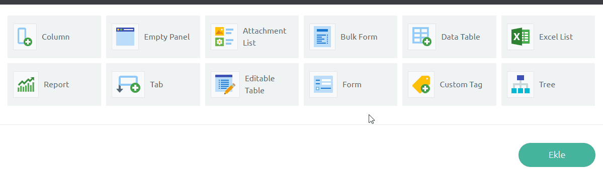

## Items
Items are helper components for content components.

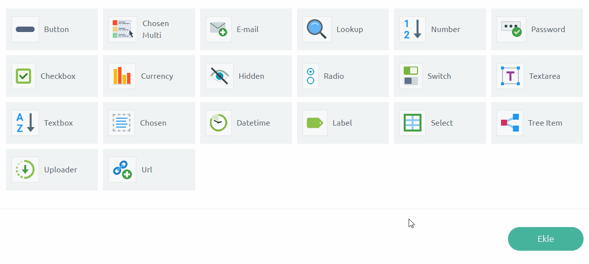

---

# Component Settings
Every component has its own settings tab and can be managed easily. Let's look at this settings. :)

## General Settings

For **contents**;

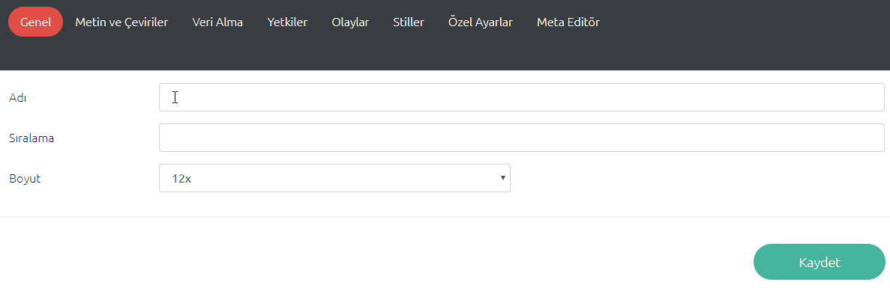

- **Name**: This is name of the content component. It should be unique in all content components.
- **Order**: This is the order of the component in the same level.
- **Size**: This is the size of the component. Sizes are same with **Bootstrap** grid classes.

For **items**;

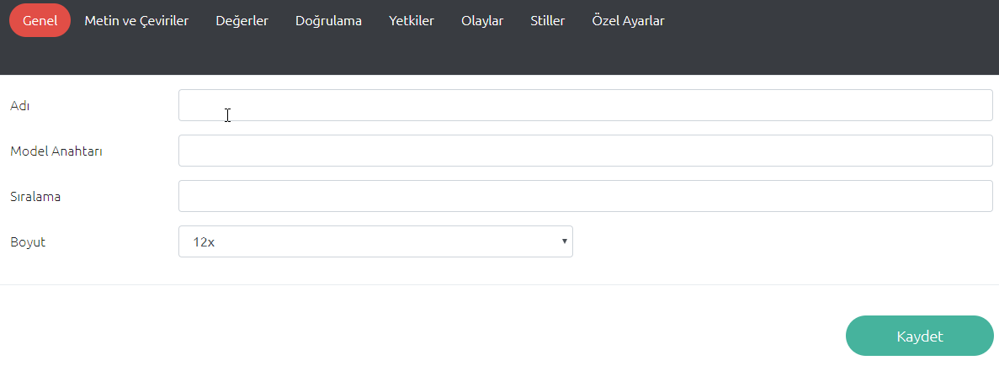

- **Name**: This is name of the item component. It should be unique in parent content component.
- **Model Key**: This is the content model property for data binding.
- **Order**: This is the order of the component in the same level.
- **Size**: This is the size of the component. Sizes are same with **Bootstrap** grid classes.

## Language Settings
Every component has special DOM elements for setup its some properties. This is language settings for label elements.

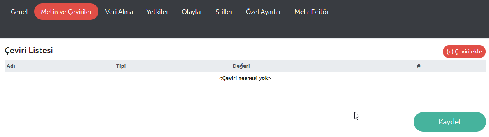

- **Element**: Label element want to add text
- **Type**: Language type (TR, EN, etc.)
- **Value**: Text for selected element and language.

## Getting Data Settings

Getting data settings are for adding model to component via created data source.

> _**It can be accessed from console.**_

- For contents:
    - `<CONTENT_NAME>.model`,
    - `frmUser.model`
- For items:
    - `<PARENT_CONTENT_NAME>.<ITEM_NAME>.model`,
    - `<PARENT_CONTENT_NAME>.<ITEM_NAME>[<MODEL_INDEX>].model`,
    - `frmUser.txtName[3].model`

---

> _**Items have another settings with getting data called as Data Show Settings. Because items show their models as dropdown or modal dialog.**_
 
Settings panel in **contents**;

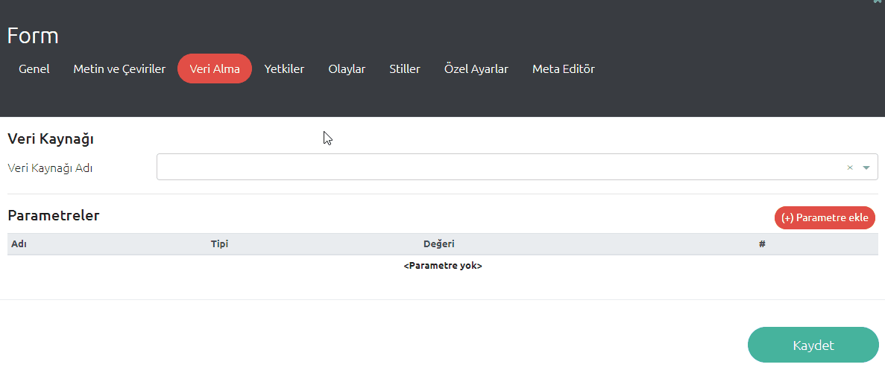

Settings panel in **items**;

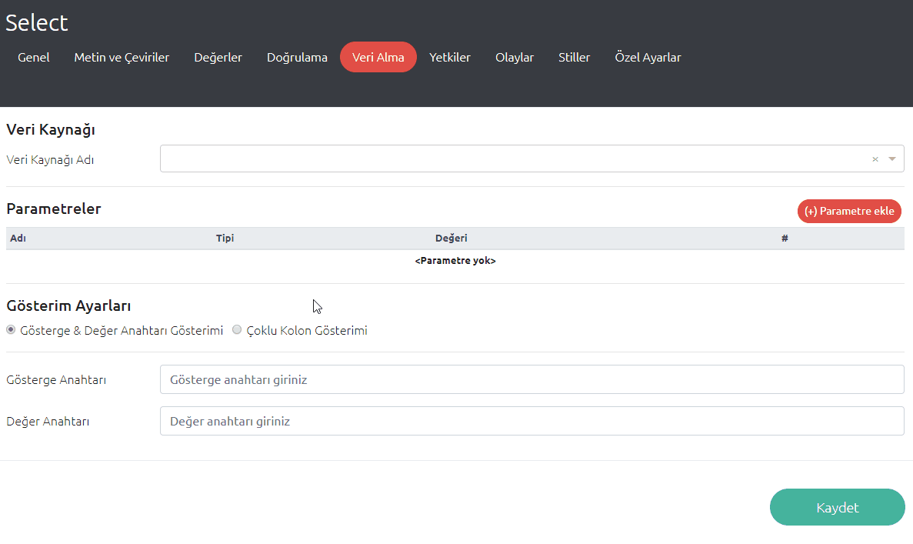

## Value Settings

Value settings are only for item components. We can set default value for items with value settings. This value can be

- Global Dynamic Variable
- Static Variable
- Data Source

and we should set `Data Show Settings` for data source value or global dynamic `Object` variable.

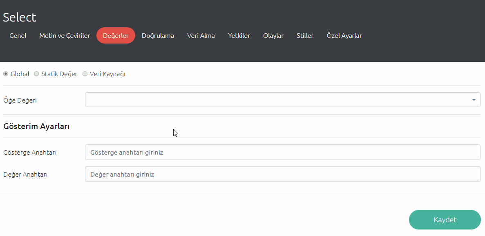

## Validation Settings

Validation settings are only for item components. We can validate item components and their special elements with validation settings like `max-length`, `min-length`, `regex`, etc.

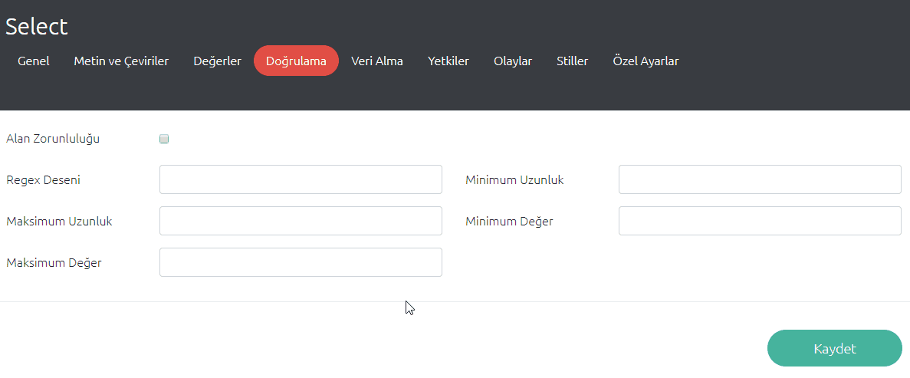

## Auth Settings

We can give auth objects for all components and their special elements.

> _**If you do not export the element to the auth object, it is displayed in all auth objects.**_

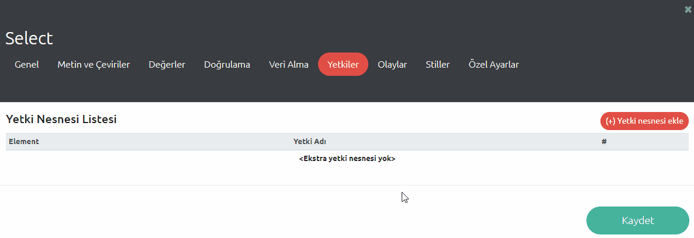

## Event Settings

We can set some events for all components and their special elements. These events are

- `onClick`
- `beforeClick`
- `clickSuccessCallback`
- `clickFailureCallback`
- `onChange`
- `onInit`

and we can trigger events for

- data sources with parameters
- controller functions with parameters
- page redirect on new page, same page or modal with state parameters

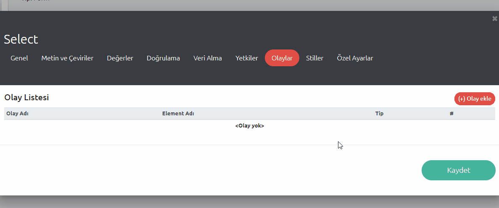

## Style Settings

We can set **class** and **id** values for components and their special elements.

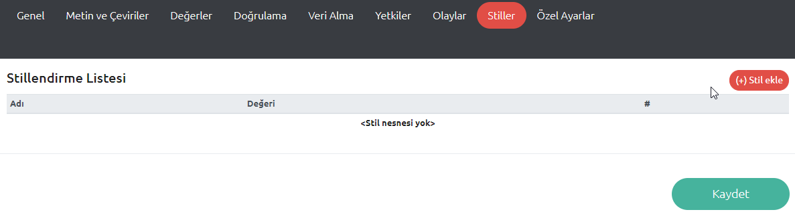

## Special Settings

Some components have special settings panel with its own properties.
