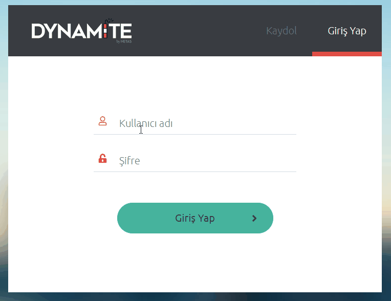

# Introduction

Dynamite is a web page design tool for Mobi-fi Service Management Application for now. You can design new or existing pages in Dynamite by using awesome components.

    Dynamite is the best page design tool for Mobi-fi!
---

# 1. Login to App

- Enter Dynamite web site and go `/login` page.
- **Username** and **password** is your personal admin username for **Test Environment.**
- Enter your credentials and click login button.

---

# 2. Welcome Screen

## After login...

    After login, you will see 'Settings and services are loading...' text.
    This is for loading of Mobi-fi API Endpoint list.
    [Only for login to app] :)
    

## We are ready, and you?
- We have page list on left sidebar,
- Platform, project, auth object dropdowns on top right panel,
- and welcome message :)

